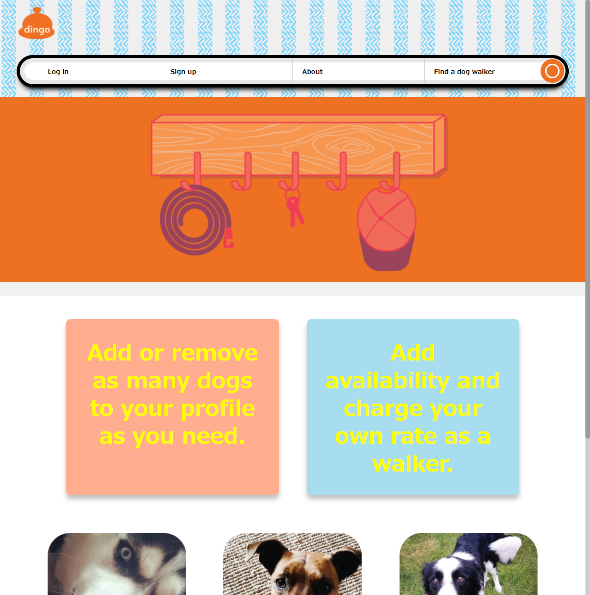
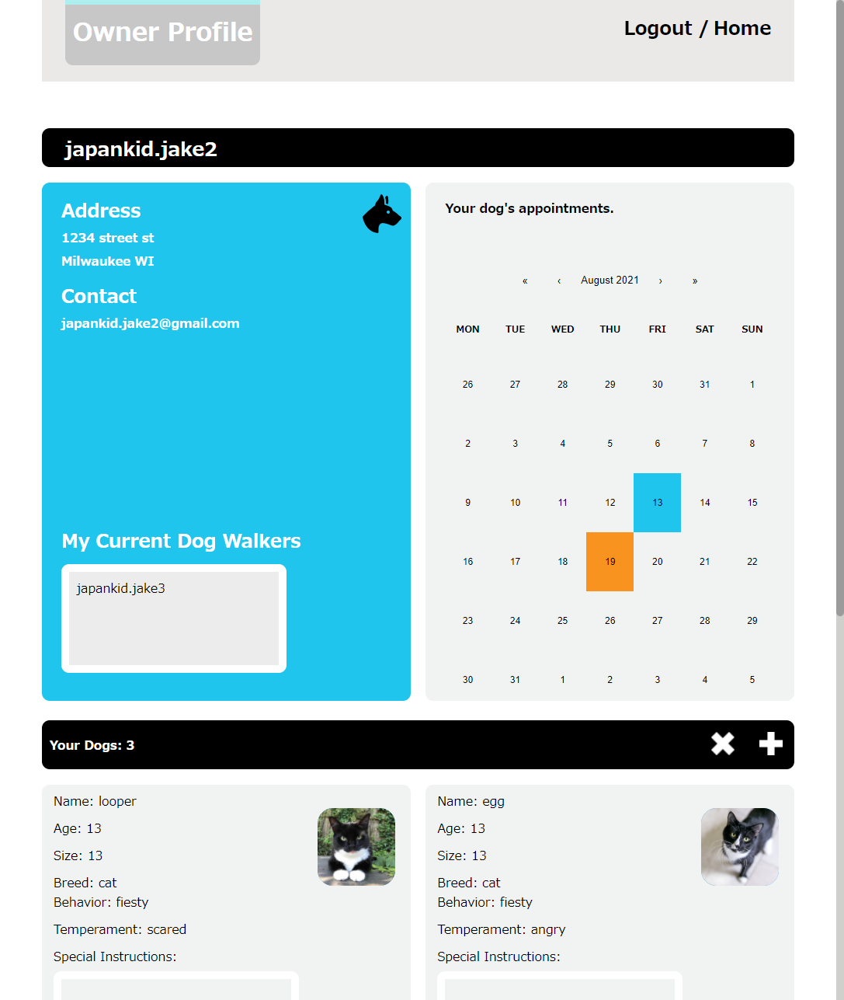
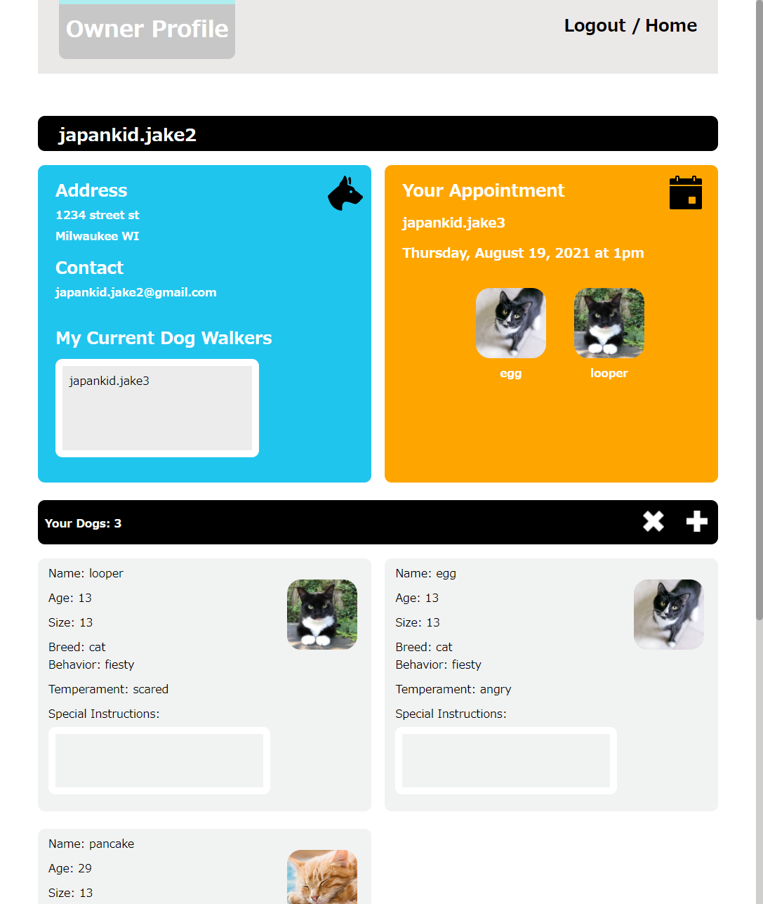
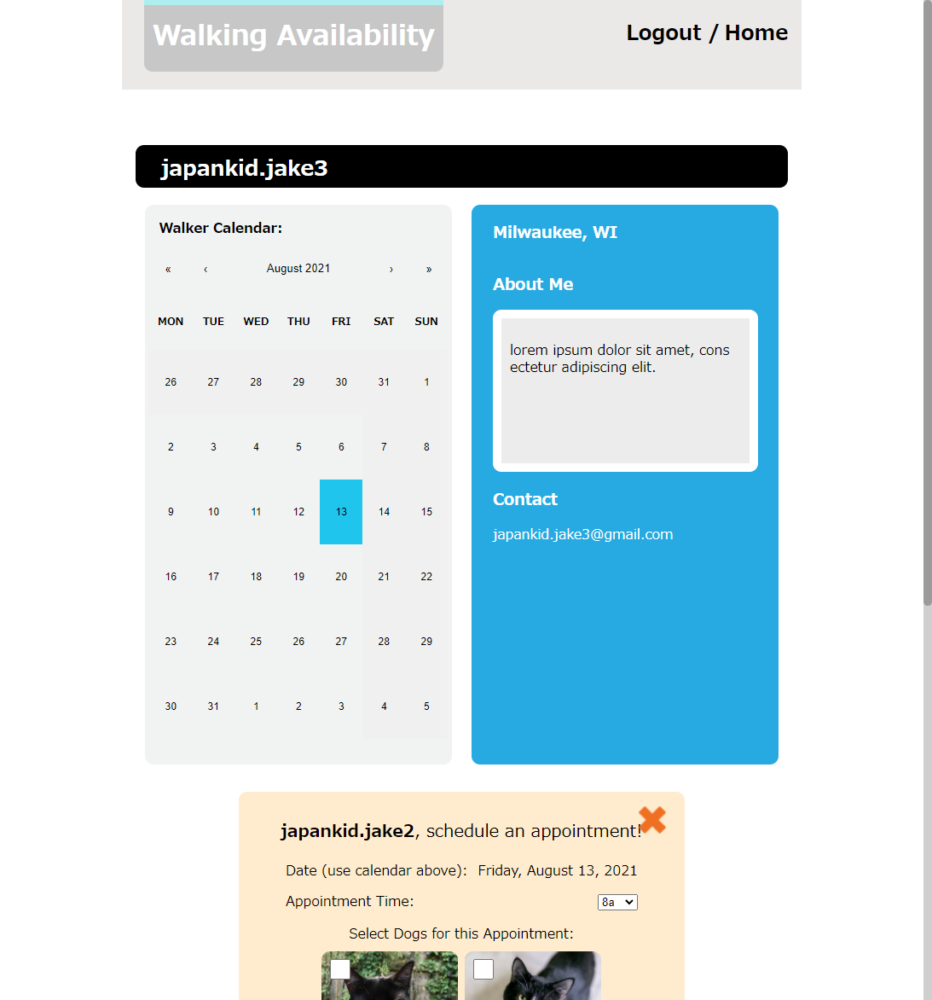
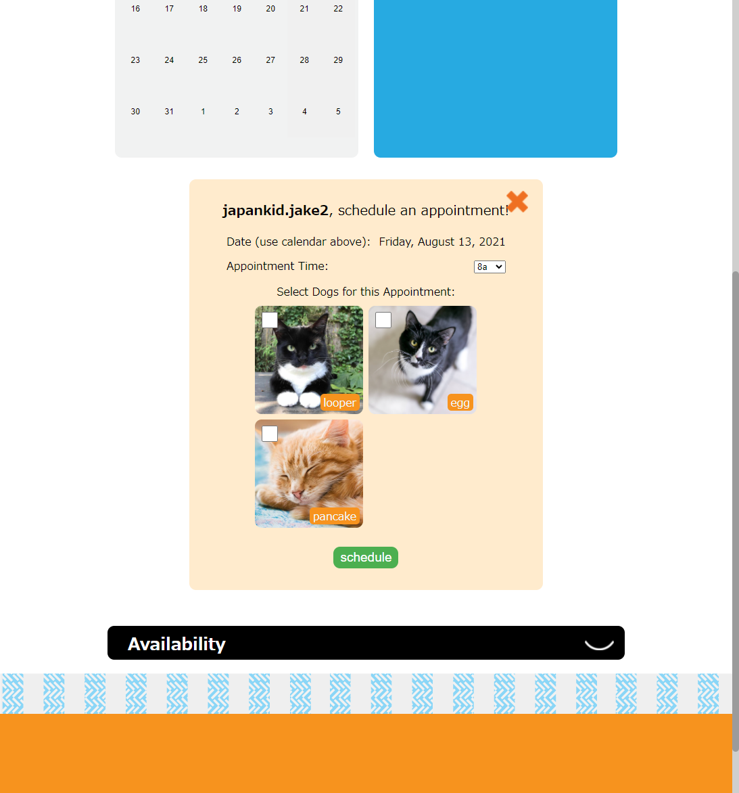
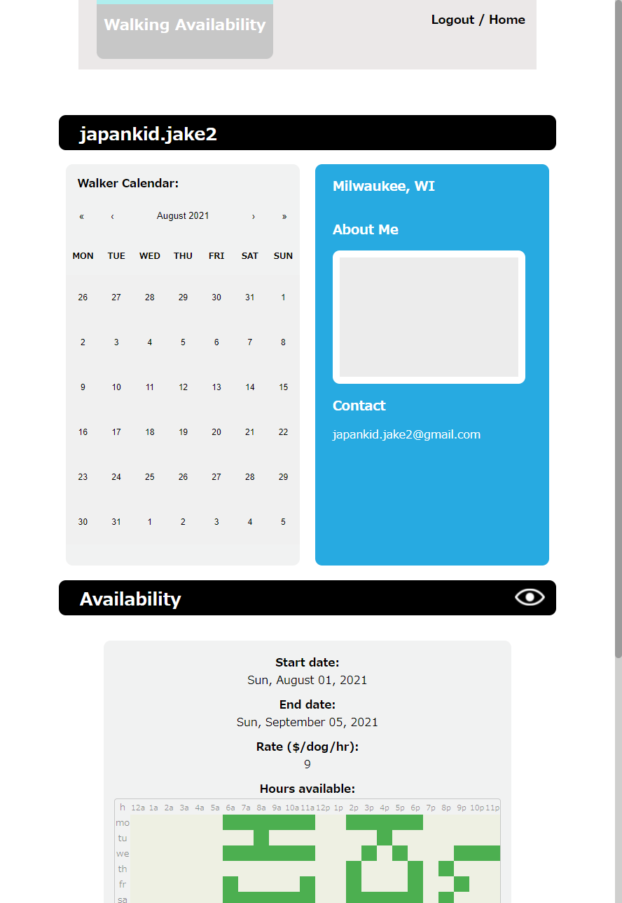
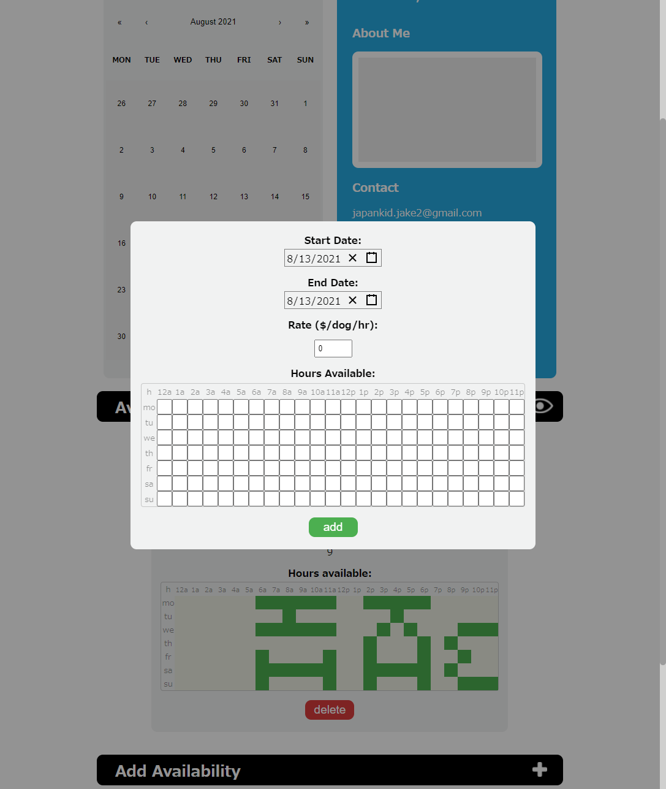

# dingo

app for dogs and their walkers. Link to repo is [here](https://github.com/bc-mern-stack/dingo). App is [deployed here](https://dingo-dog-walker.herokuapp.com/)


[](https://gitmoji.dev)

## Table of Contents

- [Installation](#installation)
- [Usage](#usage)
- [Credits](#credits)
- [Tests](#tests)
- [Questions](#questions)

## Installation

First of all, install [node](https://nodejs.org/en/).
Here are the list of commands used to get the application working:

```bash
npm i
npm run seed
npm run develop
```

## Usage

an app for people who have dogs, but not enough time to walk them.









## Contributing

these packages were used to build this app:

- [react-calendar](https://projects.wojtekmaj.pl/react-calendar/)
- [react-date-picker](https://projects.wojtekmaj.pl/react-date-picker/)

## Tests

no testing procedures/coverage.

## Questions

If you have any questions you can email: japankid.jake@gmail.com

[Jake's Github profile](https://github.com/japankid-code).

[John's Github profile](https://github.com/Jbartlettdesign).

[//]: <> (If your project has a lot of features, consider adding a "Features" section.)
